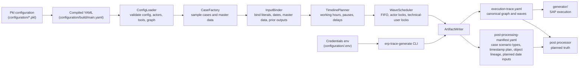

# ERP Trace Generator

`trace_generator/` turns compiled Pkl configuration YAML into:

- canonical planned execution trace YAML
- post-processing manifest YAML

## Architecture



Run:

```bash
uv run --project trace_generator erp-trace-generate configuration/build/main.yaml --out-dir trace_generator/build
```

The CLI loads runtime settings from `configuration/.env` by default. Use `--env-file path/to/file.env` when a run needs a different file.

Generated traces do not contain passwords. Canonical session blocks reference env var names so the executor can resolve usernames, passwords, and login URLs at runtime.

With realism enabled, the compiler asks the LLM for compact patterns and models, then expands exact planned cases locally. `llm_metadata` records the criteria hash, schema version, request count, retry count, and cache-hit count.

Goods receipt runtime uses SAP's current posting date. Planned goods-receipt document/posting dates stay in `planned_date_inputs` and `planned_date_input_overrides` so post-processing can rewrite material document exports.
