# ERP Trace Generator

`trace_generator/` is an independent `uv` project that turns compiled Pkl configuration YAML into planned run artifacts:

- an **Execution Trace**
- a **Post-Processing Manifest**

For the end-to-end dataset workflow, start with [the user guide](../docs/user-guide/README.md). This README is the local reference for the generator project and CLI.

## Component Role

The Trace Generator consumes exactly the configuration YAML passed on the command line. It does not automatically test or load the latest repository configuration unless you first compile that configuration and pass `configuration/build/main.yaml`.

Inputs:

- compiled configuration YAML, usually `configuration/build/main.yaml`
- optional runtime settings from an env file, especially realism LLM endpoint values
- optional CLI seed and run id overrides

Outputs:

- `<run_id>.execution-trace.yaml`
- `<run_id>.post-processing-manifest.yaml`

The Trace Generator does not log into SAP, execute Browser Tools, download SAP Exports, or post-process SAP table data.

## Bootstrap

```bash
uv sync --project trace_generator --python 3.13
```

## Run

Compile configuration first:

```bash
configuration/create-config.sh
```

Generate planned artifacts:

```bash
uv run --project trace_generator erp-trace-generate \
  configuration/build/main.yaml \
  --out-dir trace_generator/build/RUN_EXAMPLE \
  --run-id RUN_EXAMPLE
```

The CLI writes:

```text
trace_generator/build/RUN_EXAMPLE/RUN_EXAMPLE.execution-trace.yaml
trace_generator/build/RUN_EXAMPLE/RUN_EXAMPLE.post-processing-manifest.yaml
```

## CLI Reference

| Argument | Purpose |
|---|---|
| `config_path` | Path to compiled Pkl YAML, usually `configuration/build/main.yaml`. |
| `--out-dir` | Output directory for generated artifacts. Defaults to `trace_generator/build`. |
| `--env-file` | Runtime settings file. Defaults to `configuration/.env`. |
| `--run-id` | Explicit run id prefix for generated artifacts. Defaults to a timestamped `RUN_*` value. |
| `--seed` | Override scheduler seed from config. |

The CLI loads runtime settings from `configuration/.env` by default. Use `--env-file path/to/file.env` when a run needs a different file. Shell environment variables take precedence over file values.

Generated traces do not contain passwords. Actor Session blocks reference env var names so the Trace Executor can resolve usernames, passwords, and login URLs at runtime.

## Artifact Contract

The **Execution Trace** is planned truth for:

- Actor Sessions
- Process Cases
- Planned Steps
- dependencies
- Execution Waves
- Browser Tool inputs
- required SAP object keys
- Planned Synthetic Time

The **Post-Processing Manifest** is planned truth for:

- timestamp projection
- actor projection
- case scenario labels
- object lineage
- planned date input overrides
- failed-case policy

Schemas live in:

- `trace_generator/schemas/execution-trace.schema.json`
- `trace_generator/schemas/post-processing-manifest.schema.json`

## Architecture

```mermaid
flowchart LR
  pkl["Pkl configuration\n(configuration/*.pkl)"] --> yaml["Compiled YAML\n(configuration/build/main.yaml)"]
  env["Runtime env\n(configuration/.env)"] --> cli["erp-trace-generate CLI"]
  yaml --> loader["ConfigLoader\nvalidate config, actors, tools, graph"]
  loader --> cases["CaseFactory\nsample cases and master data"]
  cases --> binder["InputBinder\nbind literals, dates, master data, prior outputs"]
  binder --> timeline["TimelinePlanner\nworking hours, pauses, delays"]
  timeline --> scheduler["WaveScheduler\nFIFO, actor locks, technical-user locks"]
  scheduler --> writer["ArtifactWriter"]
  cli --> writer
  writer --> canonical["Execution Trace\ncanonical graph and waves"]
  writer --> manifest["Post-Processing Manifest\nlabels, timestamps, lineage"]
  canonical --> executor["trace_executor/\nSAP execution"]
  canonical --> post["post_processor/\nplanned truth"]
  manifest --> post
```



## Realism

With realism enabled in `configuration/run_settings.pkl`, the compiler asks the configured LLM for compact patterns and models, then expands exact planned Process Cases locally. `llm_metadata` records the criteria hash, schema version, request count, retry count, and cache-hit count.

Configure the endpoint in `configuration/.env`:

```bash
REALISM_LLM_BASE_URL=http://localhost:1234/api
REALISM_LLM_MODEL=<model-name>
REALISM_LLM_API_KEY=<optional-token>
```

The client appends `/v1/chat/completions` to `REALISM_LLM_BASE_URL`. For this project's OpenAI-compatible endpoint shape, the base URL should be the prefix before `/v1`, usually ending in `/api`; do not include `/v1` in the configured value.

See [Configuration](../configuration/README.md) for realism guardrails, material demand profiles, quantity profiles, material valuation locks, and cache behavior.

## Planned Date Inputs

Some SAP runtime actions cannot or should not use the final planned business date directly. For example, goods receipt runtime uses SAP's current posting date. Planned goods-receipt document and posting dates stay in `planned_date_inputs` and `planned_date_input_overrides` so the Post-Processor can rewrite material document exports.

## Testing

Run default tests:

```bash
uv run --project trace_generator pytest trace_generator/tests -q
```

These tests prove Trace Generator framework behavior with test-local inputs. They do not automatically validate the current repository configuration. To validate a configuration edit, run `configuration/create-config.sh` and then generate artifacts from the compiled YAML.

## Troubleshooting

Common failures:

- Unknown Browser Tool: regenerate `configuration/generated_tool_config.pkl` with `configuration/create-config.sh`.
- Missing input binding: add a binding for the required tool input in `configuration/processes.pkl`.
- Actor cannot execute a step: add the step type to the actor capability in `configuration/actors.pkl`.
- Realism endpoint fails: verify `REALISM_LLM_BASE_URL`, `REALISM_LLM_MODEL`, and optional `REALISM_LLM_API_KEY`.
- Unexpected SAP date behavior: check Planned Date Inputs and the Post-Processing Manifest before changing executor code.

## Related Documentation

- [User guide](../docs/user-guide/README.md)
- [Create a dataset](../docs/user-guide/create-dataset.md)
- [Configuration reference](../configuration/README.md)
- [Trace Executor reference](../trace_executor/README.md)
- [Post-Processor reference](../post_processor/README.md)
