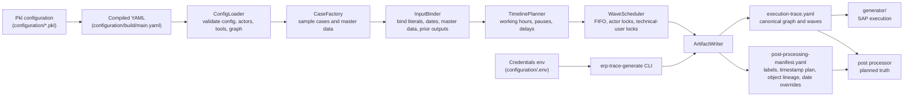

# ERP Trace Generator

`trace_generator/` turns compiled Pkl configuration YAML into:

- canonical planned execution trace YAML
- post-processing manifest YAML

## Architecture



Run:

```bash
uv run --project trace_generator erp-trace-generate configuration/build/main.yaml --out-dir trace_generator/build
```

Generated traces do not contain passwords. Canonical session blocks reference env var names so the executor can resolve usernames, passwords, and login URLs at runtime.

Goods receipt runtime uses SAP's current posting date. Planned goods-receipt document/posting dates stay in `business_dates` and `date_overrides` so post processing can rewrite material document exports.
