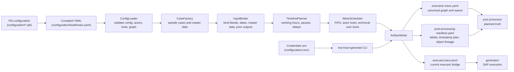

# ERP Trace Generator

`trace_generator/` turns compiled Pkl configuration YAML into:

- canonical planned execution trace YAML
- current trace-executor JSONL
- post-processing manifest YAML

## Architecture



Main responsibilities:

- `configuration/` owns experiment parameters in Pkl: process steps, tools, actors, technical users, working hours, pause ranges, and delay ranges.
- `trace_generator/` owns planning: case generation, input binding, actor assignment, synthetic timestamps, FIFO wave scheduling, validation, and artifact writing.
- `generator/` owns execution mechanics only: browser sessions, SAP tool calls, runtime placeholder resolution, and SAP object capture.
- The post processor should use the execution trace and manifest as planned truth when shifting SAP export timestamps and projecting synthetic actors.

Run:

```bash
uv run --project trace_generator erp-trace-generate configuration/build/main.yaml --env-file configuration/.env --out-dir trace_generator/build
```

The generated JSONL never contains passwords. Usernames and login URLs are resolved from the env file so the current trace executor can initialize sessions.

## Still Missing

- Config completeness: make `toolInputBindings` authoritative, validate production SAP master-data values, and add post-processing export references. Tracked in [#2](https://github.com/volume4k/advanced-synthetic-erp-data-generator/issues/2).
- Generator execution artifacts: add wave-aware execution, append-only execution logs, object registry output, and explicit required-output validation. Tracked in [#3](https://github.com/volume4k/advanced-synthetic-erp-data-generator/issues/3).
- Trace-generator maturity: add formal schemas, generic config-driven input binding, stronger validation reports, fraud graph-transform extension points, and reproducibility checks. Tracked in [#4](https://github.com/volume4k/advanced-synthetic-erp-data-generator/issues/4).
